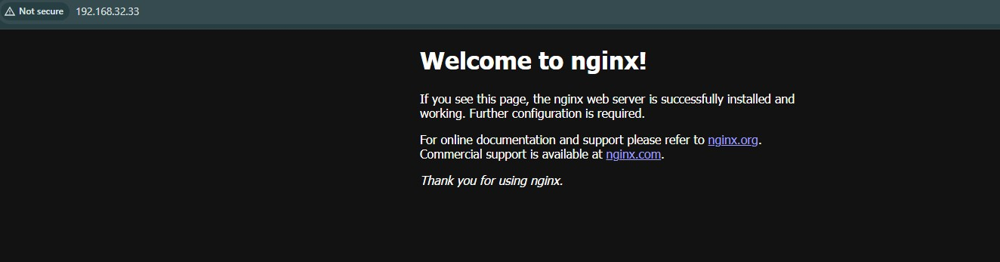
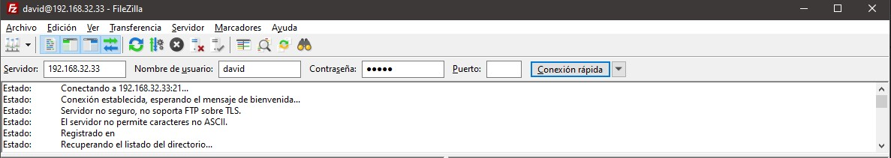
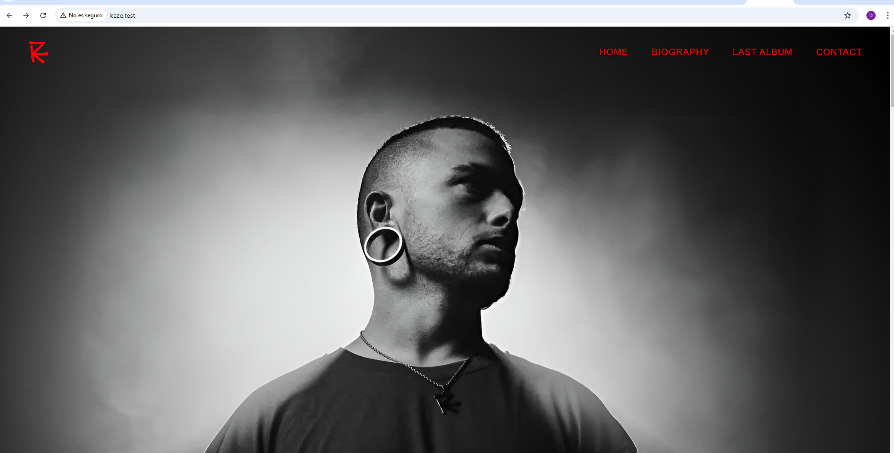

# Explicación del Script de Provisión

Este script `provision.sh` configura un servidor basado en Debian con Nginx, Git y un servidor FTP seguro (`vsftpd`), y configura dos sitios web separados alojados en el servidor. A continuación se detalla cada sección del script y lo que realiza.

## Explicación Paso a Paso

### 1. Actualizar Repositorios e Instalar Nginx
```bash
sudo apt update
sudo apt install -y nginx
```
- Actualiza las listas de paquetes e instala Nginx.

### 2. Instalar y Actualizar Paquetes Adicionales
```bash
sudo apt-get upgrade -y
sudo apt-get install -y vsftpd
git
```
- Actualiza los paquetes instalados a la última versión e instala `vsftpd` (un servidor FTP) y Git.

### 3. Comprobar el Estado de Nginx
```bash
systemctl status nginx
```
- Verifica que Nginx esté funcionando correctamente después de la instalación.




### 4. Crear el Directorio para el Primer Sitio Web
```bash
sudo mkdir -p /var/www/pagina_web/html
```
- Crea la estructura de directorios para el primer sitio web.

### 5. Clonar el Repositorio del Sitio Web
```bash
sudo git clone https://github.com/cloudacademy/static-website-example /var/www/pagina_web/html
```
- Clona un repositorio de sitio web estático en el directorio recién creado.

### 6. Asignar Permisos
```bash
sudo chown -R www-data:www-data /var/www/
sudo chmod -R 775 /var/www/
```
- Asigna la propiedad y los permisos adecuados al directorio `/var/www/` para asegurar el acceso correcto del usuario `www-data`.

### 7. Crear Configuración de Nginx para el Primer Sitio Web
```bash
sudo bash -c 'cat > /etc/nginx/sites-available/pagina_web <<EOF
server {
    listen 80;
    listen [::]:80;
    root /var/www/pagina_web/html;
    index index.html index.htm index.nginx-debian.html;
    server_name www.david.test;
    location / {
        try_files $uri $uri/ =404;
    }
}
EOF'
```
- Configura Nginx para servir el primer sitio web en `www.david.test`.
- Guarda una copia de respaldo de la configuración en `/vagrant`.

### 8. Crear un Enlace Simbólico para Nginx
```bash
sudo ln -s /etc/nginx/sites-available/pagina_web /etc/nginx/sites-enabled
```
- Habilita la nueva configuración del sitio creando un enlace simbólico en el directorio `sites-enabled`.

### 9. Reiniciar Nginx
```bash
sudo systemctl restart nginx
```
- Reinicia el servicio de Nginx para aplicar la nueva configuración.

### 10. Modificar el Archivo `hosts`
Agrega la siguiente entrada al archivo `hosts` de la máquina anfitriona (`/etc/hosts`) para mapear la dirección IP del servidor a los nombres de dominio:
```
<ip-del-servidor> www.david.test
```
- Esto permite que tu ordenador reconozca el dominio.

### 11. Imagen de Verificación para el Primer Sitio Web
Asegúrate de que el primer sitio web sea accesible navegando a `www.david.test` en tu navegador.


### 12. Crear un Segundo Directorio de Sitio Web
```bash
sudo mkdir -p /var/www/kaze/html
```
- Crea un nuevo directorio para el segundo sitio web.

### 13. Asignar Permisos para el Segundo Sitio Web
```bash
sudo chown -R www-data:www-data /var/www/kaze/html
sudo chmod -R 755 /var/www/kaze
```
- Asigna los permisos adecuados al directorio del segundo sitio web.

### 14. Crear Configuración de Nginx para el Segundo Sitio Web
```bash
sudo bash -c 'cat > /etc/nginx/sites-available/kaze <<EOF
server {
    listen 80;
    listen [::]:80;
    root /var/www/kaze/html;
    index index.html index.htm index.nginx-debian.html;
    server_name www.kaze.test;
    location / {
        try_files $uri $uri/ =404;
    }
}
EOF'
```
- Configura Nginx para servir el segundo sitio web en `www.kaze.test`.
- Guarda una copia de respaldo de la configuración en `/vagrant`.

### 15. Habilitar el Segundo Sitio Web
```bash
sudo ln -s /etc/nginx/sites-available/kaze /etc/nginx/sites-enabled
```
- Habilita la configuración del segundo sitio web creando un enlace simbólico.

### 16. Reiniciar Nginx Nuevamente
```bash
sudo systemctl restart nginx
```
- Reinicia Nginx para aplicar los cambios de configuración.

### 17. Modificar el Archivo `hosts`
Agrega la siguiente entrada al archivo `hosts` de la máquina anfitriona (`/etc/hosts`) para mapear la dirección IP del servidor a los nombres de dominio:
```
<ip-del-servidor> www.kaze.test
```
- Esto permite que tu ordenador reconozca el dominio.

### 18. Crear un Nuevo Usuario para FTP
```bash
sudo adduser david
echo "david:david" | sudo chpasswd
```
- Crea un nuevo usuario `david` y establece la contraseña en `david`.

### 19. Agregar Usuario al Grupo `www-data`
```bash
sudo usermod -aG www-data david
```
- Añade `david` al grupo `www-data` para garantizar los permisos adecuados.

### 20. Crear Directorio para el Servidor FTP
```bash
sudo mkdir /home/david/ftp
sudo chown david:david /home/david/ftp
sudo chmod 775 /home/david/ftp
sudo chown david:www-data /home/david/ftp
```
- Crea y asigna los permisos correctos para el directorio FTP.

### 21. Copiar Certificados de Seguridad
```bash
sudo cp /vagrant/vsftpd.crt /etc/ssl/certs/vsftpd.crt
sudo cp /vagrant/vsftpd.key /etc/ssl/private/vsftpd.key
```
- Copia los certificados SSL necesarios para un FTP seguro (FTPS).

### 22. Actualizar la Configuración de `vsftpd`
```bash
sudo cp /vagrant/vsftpd.conf /etc/vsftpd.conf
```
- Reemplaza la configuración existente de `vsftpd` con el archivo de configuración personalizado.

### 23. Reiniciar los Servicios de `vsftpd` y Nginx
```bash
sudo systemctl restart vsftpd
sudo systemctl restart nginx
```
- Reinicia `vsftpd` y Nginx para aplicar los cambios de configuración.

### 24. Imagen de Verificación para la Conexión FTP
Asegúrate de poder conectarte al servidor FTP con FileZilla u otro cliente.



### 25. Imagen de Verificación para la Transferencia de Archivos
Verifica que el segundo sitio web sea accesible después de transferir archivos mediante FTP navegando a `www.kaze.test` en tu navegador.



## Cuestiones Finales

### ¿Qué pasa si no hago el link simbólico entre `sites-available` y `sites-enabled` de mi sitio web?
Si no se crea el enlace simbólico, Nginx no cargará la configuración de tu sitio web y no estará disponible al acceder a la dirección del servidor. `sites-enabled` es el directorio que Nginx usa para activar los sitios.

### ¿Qué pasa si no le doy los permisos adecuados a `/var/www/nombre_web`?
Si los permisos no son correctos, Nginx puede no tener acceso a los archivos del sitio web, lo que resultará en errores de acceso denegado o páginas que no se cargan correctamente. Esto podría afectar la capacidad del servidor para servir los archivos del sitio a los usuarios.
